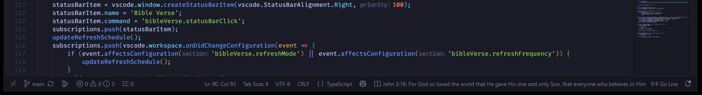

# Bible Verse Status Bar ✝

Shows a random Bible verse in the VS Code status bar, which changes over time.

## Features ✨

- Displays a Bible verse in the VS Code status bar.
- Shows the full verse in the tooltip when you hover over the status bar item.
- Clicking the status bar item can either show the full verse in a notification or display a new random verse, depending on your settings.

## Extension Settings ⚙️

- This extension supports settings for:
  - `bibleVerse.displayFullVerse` (default: `true`)
  - `bibleVerse.statusBarWidth` (default: `200`)
  - `bibleVerse.shrinkToFit` (default: `true`), which avoids reserving unused space when a verse is shorter than the configured width. The width still limits long verses.
  - `bibleVerse.clickAction` (default: `showVerse`): choose between displaying the full verse in a notification or showing a new random verse when the status bar item is clicked.
  - `bibleVerse.refreshMode` (default: `onVSCodeOpen`): choose whether the verse changes only when VS Code opens or periodically on a schedule.
  - `bibleVerse.refreshFrequency` (default: `60`): minutes between scheduled changes; used only when `bibleVerse.refreshMode` is `schedule`.
  - `bibleVerse.randomOrSequential` (default: `random`)
  - `bibleVerse.bibleId` (default: `3034`, Berean Standard Bible): enter a YouVersion Bible ID from the [YouVersion API documentation](https://developers.youversion.com/docs). If the ID is invalid or unavailable, the extension tries Bible ID `3034` (Berean Standard Bible) before using bundled sample verses.
  - `bibleVerse.showBibleVersionInTooltip` (default: `true`): include the Bible version abbreviation in parentheses after the verse reference in the status bar hover tooltip.

## Getting Started 👇

1. Create or sign in to your account on the [YouVersion Platform](https://platform.youversion.com/).
2. Register your application in the platform portal and follow the [API Usage guide](https://developers.youversion.com/api-usage) to obtain an App Key. Make sure the Bible version you want to use is available to your application; some versions may require accepting a license agreement.
3. In VS Code, open the Command Palette with `Ctrl+Shift+P` on Windows/Linux or `Cmd+Shift+P` on macOS.
4. Run `Bible Verse: Store YouVersion App Key`.
5. Paste your App Key into the password-style input prompt and press Enter. The extension stores it in VS Code SecretStorage and uses it in requests to the YouVersion API.

Use your own App Key for your registered application. Keep it private and do not commit it to a repository or share it publicly. To replace or remove the saved key, run `Bible Verse: Store YouVersion App Key` again or run `Bible Verse: Clear YouVersion App Key` from the Command Palette.

If the key is missing, invalid, or the API request fails, the extension displays one of its bundled sample verses instead. The default Bible ID is `3034` (Berean Standard Bible); you can change it in Settings if your application has access to another version.

## Requirements 📦

- Visual Studio Code / Visual Studio Code for the Web running on any operating system
- Will work with Visual Studio Code 1.120.0 or later (more recent)

## Known Issues 🐛

- The API key can't be stored in the extension's settings because it would be visible to anyone who can read the settings file. In order to actually use the API, you must get your own App Key from the YouVersion Platform and store it in VS Code SecretStorage using the `Bible Verse: Store YouVersion App Key` command.

## Release Notes 🆕

See [CHANGELOG](https://github.com/BenRogersWPG/Bible-Status-Bar-VSCode/blob/main/CHANGELOG.md) file.

## Software Details 💿

* **Author:** Ben Rogers
* **Date Published:** 10/9/2026, 1:54:49 PM
* **Publisher:** Ben Rogers
* **Software Version:** 0.0.2
* **Last Updated:** 10/9/2026, 7:46:00 PM
* **Average Rating:** 0
* **Rating Count:** 0
* **Category:** DeveloperApplication
* **Unique Identifier:** BenRogersWPG.bible-verse-statusbar
* **Install URL:** [https://marketplace.visualstudio.com/items?itemName=BenRogersWPG.bible-verse-statusbar](https://marketplace.visualstudio.com/items?itemName=BenRogersWPG.bible-verse-statusbar)
* **Project URL:** [https://github.com/BenRogersWPG/Bible-Status-Bar-VSCode](https://github.com/BenRogersWPG/Bible-Status-Bar-VSCode)

* 

<!-- JSON-LD markup generated by Google Structured Data Markup Helper. -->

